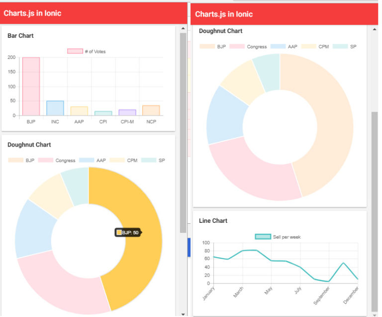

# Como adicionar um gráfico do chart.js aos aplicativos Ionics

<h1 align="center"></img></h1>

Podemos adicionar um gráfico em aplicativos iônicos dos diferentes biblioteca, as bibliotecas mais populares para gráficos acrescentando são D3, Chart.js e angular2-Highcharts. É fácil adicionar o Chart.js na estrutura Ionic em comparação com o D3. O chart.js é uma biblioteca Javascript que usa o elemento ```<canvas>``` HTML5 para exibir gráficos, o que é perfeito para um aplicativo móvel HTML5. Os gráficos são super simples de configurar, têm uma aparência bonita e são responsivos por padrão - para que eles sejam dimensionados facilmente com o aplicativo conforme você alterna entre dispositivos ou orientação da tela.


### Etapa Criando gráficos no Ionic:

#### Passo 1: 
```
ionic start charts blank
cd charts
npm install chart.js --save
```

## Etapa 2: adicione o seguinte código em home.html.  

```
<ion-header>
  <ion-toolbar>
    <ion-title>
      Charts.js in Ionic
    </ion-title>
  </ion-toolbar>
</ion-header>

<ion-content>
  <div class="ion-padding">
    <ion-card>
      <ion-card-header>
        Bar Chart
      </ion-card-header>
      <ion-card-content>
        <canvas #barCanvas></canvas>
      </ion-card-content>
    </ion-card>

    <ion-card>
      <ion-card-header>
        Doughnut Chart
      </ion-card-header>
      <ion-card-content>
        <canvas #doughnutCanvas></canvas>
      </ion-card-content>
    </ion-card>
 
    <ion-card>
      <ion-card-header>
        Line Chart
      </ion-card-header>
      <ion-card-content>
        <canvas #lineCanvas></canvas>
      </ion-card-content>
    </ion-card>
  </div>
</ion-content>
```

Temos três cartões, cada cartão possui um elemento canvas , e adicionamos uma variável local como, para #barCanvasque possamos pegar facilmente uma referência a ela em nosso arquivo TypeScript.

#### Adicione o seguinte código em home.ts 

```
import { Component, ViewChild, OnInit } from '@angular/core';
import { Chart } from 'chart.js';

@Component({
  selector: 'app-home',
  templateUrl: 'home.page.html',
  styleUrls: ['home.page.scss'],
})

export class HomePage implements OnInit {
  @ViewChild('barCanvas') barCanvas;
  @ViewChild('doughnutCanvas') doughnutCanvas;
  @ViewChild('lineCanvas') lineCanvas;

  barChart: any;
  doughnutChart: any;
  lineChart: any;

  constructor() {

  }

  ngOnInit() {
    this.barChartMethod();
    this.doughnutChartMethod();
    this.lineChartMethod();
  }

  barChartMethod() {
    this.barChart = new Chart(this.barCanvas.nativeElement, {
      type: 'bar',
      data: {
        labels: ['BJP', 'INC', 'AAP', 'CPI', 'CPI-M', 'NCP'],
        datasets: [{
          label: '# of Votes',
          data: [200, 50, 30, 15, 20, 34],
          backgroundColor: [
            'rgba(255, 99, 132, 0.2)',
            'rgba(54, 162, 235, 0.2)',
            'rgba(255, 206, 86, 0.2)',
            'rgba(75, 192, 192, 0.2)',
            'rgba(153, 102, 255, 0.2)',
            'rgba(255, 159, 64, 0.2)'
          ],
          borderColor: [
            'rgba(255,99,132,1)',
            'rgba(54, 162, 235, 1)',
            'rgba(255, 206, 86, 1)',
            'rgba(75, 192, 192, 1)',
            'rgba(153, 102, 255, 1)',
            'rgba(255, 159, 64, 1)'
          ],
          borderWidth: 1
        }]
      },
      options: {
        scales: {
          yAxes: [{
            ticks: {
              beginAtZero: true
            }
          }]
        }
      }
    });
  }

  doughnutChartMethod() {
    this.doughnutChart = new Chart(this.doughnutCanvas.nativeElement, {
      type: 'doughnut',
      data: {
        labels: ['BJP', 'Congress', 'AAP', 'CPM', 'SP'],
        datasets: [{
          label: '# of Votes',
          data: [50, 29, 15, 10, 7],
          backgroundColor: [
            'rgba(255, 159, 64, 0.2)',
            'rgba(255, 99, 132, 0.2)',
            'rgba(54, 162, 235, 0.2)',
            'rgba(255, 206, 86, 0.2)',
            'rgba(75, 192, 192, 0.2)'
          ],
          hoverBackgroundColor: [
            '#FFCE56',
            '#FF6384',
            '#36A2EB',
            '#FFCE56',
            '#FF6384'
          ]
        }]
      }
    });
  }

  lineChartMethod() {
    this.lineChart = new Chart(this.lineCanvas.nativeElement, {
      type: 'line',
      data: {
        labels: ['January', 'February', 'March', 'April', 'May', 'June', 'July', 'August', 'September', 'November', 'December'],
        datasets: [
          {
            label: 'Sell per week',
            fill: false,
            lineTension: 0.1,
            backgroundColor: 'rgba(75,192,192,0.4)',
            borderColor: 'rgba(75,192,192,1)',
            borderCapStyle: 'butt',
            borderDash: [],
            borderDashOffset: 0.0,
            borderJoinStyle: 'miter',
            pointBorderColor: 'rgba(75,192,192,1)',
            pointBackgroundColor: '#fff',
            pointBorderWidth: 1,
            pointHoverRadius: 5,
            pointHoverBackgroundColor: 'rgba(75,192,192,1)',
            pointHoverBorderColor: 'rgba(220,220,220,1)',
            pointHoverBorderWidth: 2,
            pointRadius: 1,
            pointHitRadius: 10,
            data: [65, 59, 80, 81, 56, 55, 40, 10, 5, 50, 10, 15],
            spanGaps: false,
          }
        ]
      }
    });
  }

} 
```
 
 
<p>Aviso: - Estamos importando o **Chart.js**, e também estamos importando **ViewChild**. Usamos o ViewChild para obter uma referência à variável local que anexamos à tela no modelo e, em seguida, fornecemos esse elemento ao novo gráfico quando estamos criando. Tudo o que precisamos fazer é fornecer ao Chart um objeto que defina o tipo de gráfico que queremos e o tipo de dados que queremos exibir.</p>

*Não precisamos adicionar nada ao arquivo app.module.ts.*